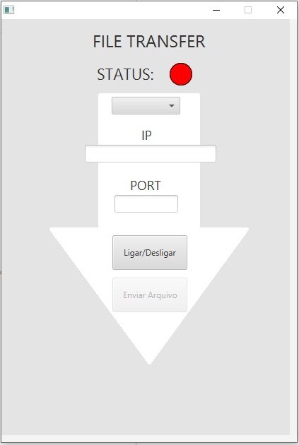
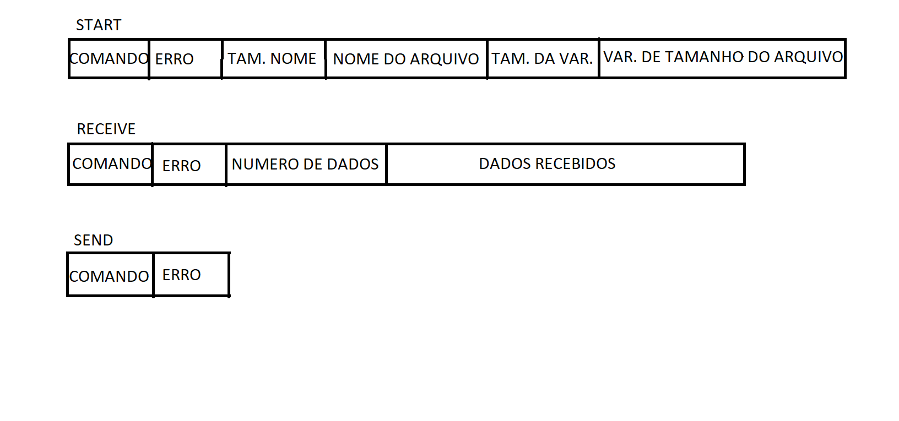

# Projeto Redes de computadores
# Alunos:
## Jeferson Fernando da Silva Santos
## João Victor Holanda da Silva
#

    

# Resumo
O projeto trata-se de um sistema de transferência de arquivos, havendo no mesmo sistema, a possibilidade de seleção entre Servidor e Cliente. Tal sistema, permite que haja a transferência bilateral de arquivos, desde que a solicitação seja aceita.
 
O projeto foi projetado e desenvolvido com um protocolo definido de transferência de dados, desse modo, ambos os dispositivos podem enviar dados um para o outro ao mesmo tempo, sem haver interferência na integridade dos dados dos arquivos, bem como haver a inserção de novos comandos para outras funcionalidades futuras.

### PROTOCOLOS PARA OS COMANDOS CRIADOS:

    

 

# Como executar

Para abrir e compilar o projeto, deve-se instalar o JAVA JDK e o IDE NETBEANS. (https://www.oracle.com/technetwork/java/javase/downloads/jdk-netbeans-jsp-3413139-esa.html).

Após o projeto ser compilado, o mesmo poderá ser executado diretamente no IDE ou pelo executável gerado no seguinte diretório:  dist/FileTransfer.jar

 

Uma vez aberto o programa, deve-se selecionar na caixa de seleção, se esse ponto será cliente ou servidor.

 

### Cliente

Selecionado o modo cliente, as caixas "IP" e "PORTA" serão habilitadas, nelas deverão ser inseridos os dados de endereço ip e porta do servidor ao qual o cliente irá conectar-se.

 

### Servidor

Selecionado o modo servidor, a caixa "PORTA" será habilitada, e nela deverá ser inserida a porta à qual o servidor irá ser acessado.

 

### Botão liga/Desliga

Uma vez configurados os dados anteriores, pode-se clica rno botão liga/desliga, que conecta ou desconecta o servidor ou cliente. Caso a opção servidor tiver sido selecionada para o ponto, na caixa "IP" irá aparecer os endereços local e público da rede que poderão ser utilizados para informar o cliente qual IP o mesmo irá conectar-se.

 

### Enviando arquivos

Após Cliente e Servidor tiverem se conectado, o botão Enviar arquivo será habilitado para ambos. Ao clicar nele, uma caixa de seleção de arquivos será iniciada, nela deverá ser indicado qual arquivo irá ser transferido.

 

Após o arquivos ser selecionado, o outro ponto irá receber uma mensagem de solicitação de transferência de arquivo, informando o nome e o tamanho do mesmo. Irão aparecer botões de Aceitar e Recusar.
 
Após Aceitar, uma caixa de seleção de destino será inicializada, para ser selecionado o local de destino do arquivo. Uma vez selecionado o destino, a transferência será iniciada e indicadores de progresso irão informar o status da transferência.
